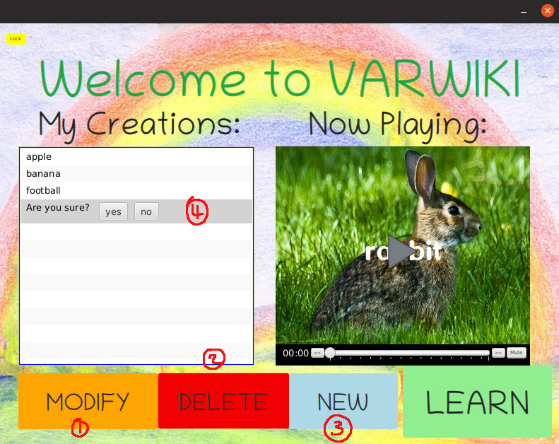

# VARWIKI

Designed a Java application that creates educational videos from Wikipedia articles.

The system was developed and implemented on an Ubuntu 18.04/Linux OS. Bash scripting was utilized for functionality, development and deployment of project. Developed a GUI interface using JavaFX and Scenebuilder

This Assignment should be run on the SOFTENG 206 VirtualBox Image. 

## Libraries to include
If you are working with the source code, the following libarires are needed to be added.
javaFX13

Flickr-api-Libraries:
flickr4java-3.0.1.jar  
jackson-annotations-2.9.0.jar  
jackson-core-2.9.9.jar  
jackson-databind-2.9.9.jar  
scribejava-apis-6.6.3.jar   
scribejava-core-6.2.0.jar
slf4j-api-1.7.25.jar  
slf4j-nop-1.7.26.jar  
(THE ABOVE LIBRARIES CAN BE FOUND THE IN 206_Flickr_Example ACP PROJECT)

## Flickr API Keys

Add txt file containing API keys into folder: "./resources/flickr-api-keys.txt"   
This should be relative to the executable jar file.

## References

Background Music - Calling on Dolphins by fourstones (c) copyright 2016 Licensed under a Creative Commons Attribution Noncommercial  (3.0) license. http://dig.ccmixter.org/files/victor/53226 

Background Image - https://blog.bellalunatoys.com/2010/stockmar-beeswax-crayons-2.html

./src/application/getFlickr.java - Some of the implementation of this class was obtained from the ACP project by Nasser Giacamen 206_Flickr_Example

## Running Application

referenece user manual

[userManual](/UserManual.md)
