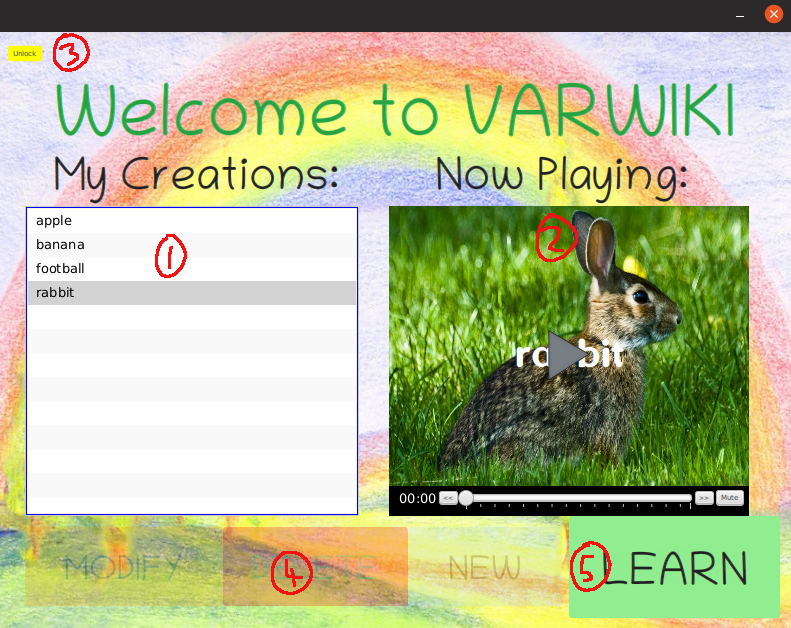
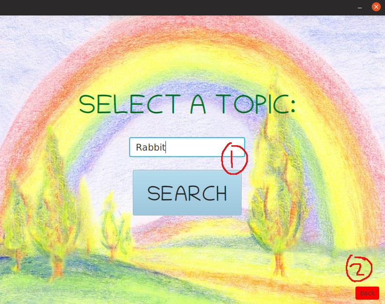
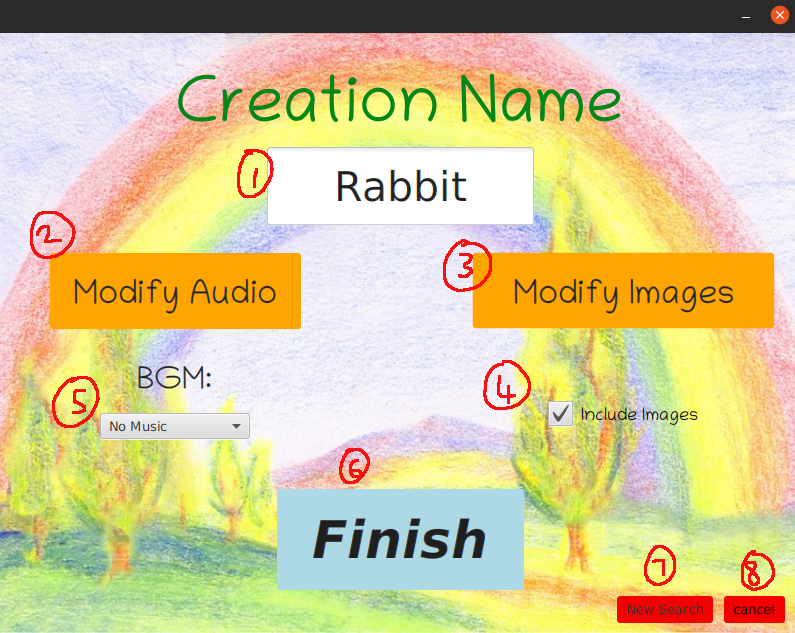
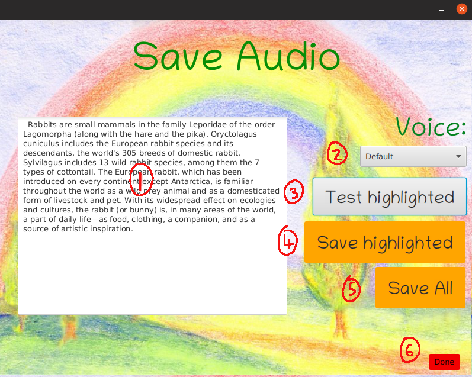
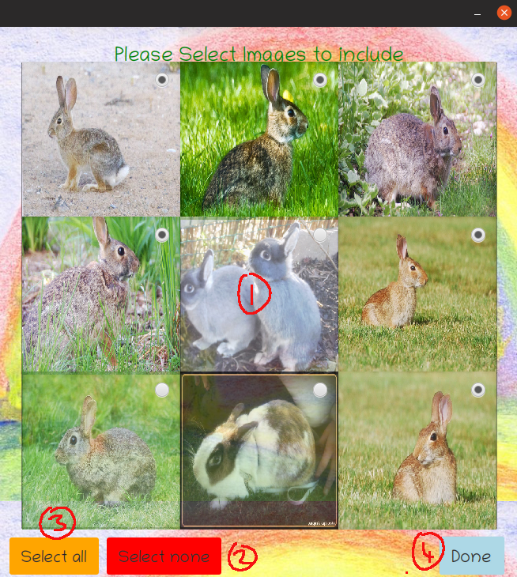
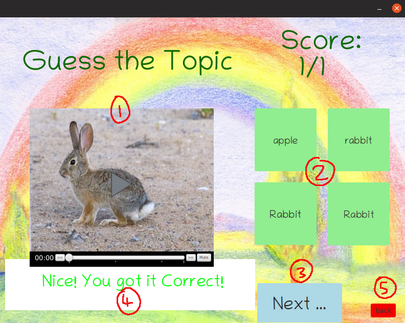
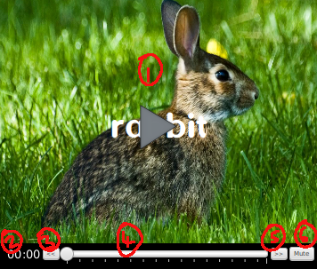

# VARWIKI - User Manual 

This application is intended for the educational development of children (7-10).
Parental Guidance is recommended for the safety and learning efficiency of the child.

## Table of contents

<!--ts-->

   * [Launching](#launching)
      * [Set Up](#set-up)
      * [Running Application](#running-application)
   * [Main Menu](#main-menu)
   * [Search Menu](#search-menu)
   * [Create Menu](#create-menu)
   * [Modify Audio](#modify-audio)
   * [Create Audio](#create-audio)
   * [Image Selection](#image-selection)
   * [Media Player](#media-player)
   * [Matching Game](#matching-game)
<!--te-->


## Launching

### Set Up
This project was built using the the following operating system and packages. It should preferably be run under the same conditions.

The operating system is Linux Ubuntu 19.04.

Java Run-time:
Java 13 was used to build this project, and should also be used to run it.

Installed Packages:
 ffmpeg
 soxi
 festival
 wikit
 npm

If you have access to the `softeng206_ubuntu_image_updated.ova` then all required packages should be already installed.


Make sure the following folders and files attached with this project are in the same directory as the Jar.

`/resources`
`/run.sh`


### Running Application

Use the attached script file to run the java application.

```bash
source run.sh
```

<div style="page-break-after: always;"></div>


## Main Menu




1) This box shows a list of all past creations. 
2) All Past Creations can be replayed In the [media player](#media-player).
3) Button locks and unlocks screen
4) These options are greyed out. Will become functional if screen is unlocked


Video Creation, Modification and Deletion should all be done under parental guidance and supervision. Parental guidance is recommended to ensure the child's safety and optimise the learning potential of this application.

5) This button leads to the Matching Quiz [Game](#matching-game)


This is an example of the screen Unlocked

1) [Create a new creation](#search-menu). Takes user to search for a topic
2) Modify a current creation. Sends user to create menu, but with existing video data
3) Delete a creation
4) To complete the delete operation, the application needs confirmation from the user


<div style="page-break-after: always;"></div>
## Search Menu



1) Enter a search term to continue (The search term must be discover-able on Wikipedia).
2) returns to [main menu](#main-menu)

<div style="page-break-after: always;"></div>
## Create Menu



1) Name of the Video Creation can be edited. Default name is creation topic
2) [Modify Audio](#modify-audio)
3) [Image Selection](#image-selection)
4) Include Images or not
5) Select Background Music
6) After the user has finished editing (There must be at least 1 audio file made) the user can complete the creation process. The video is made and you are returned to the [main menu](#main-menu)
7) New Search sends user back to [search screen](#search-menu)
8) Cancel returns user back to [main menu](#main-menu)

<div style="page-break-after: always;"></div>
## Modify Audio


1) Audio chunks are stored in this list. (The final video created will contain the audio stored in this list according to the vertical order)
2) Selected audio chunk can be played back
3) Selected audio chunk can be deleted
4) Position of audio chunk can be moved up or down
5) [Create New Audio Chunks](#create-audio)
6) return to [Create Menu](#create-menu)

<div style="page-break-after: always;"></div>
## Create Audio



1) text obtained from wikipedia is stored here
2) Select the voice package used in text to speech translation of text
3) Test the text to speech translation of highlighted text
4) Save Text to speech translation of highlighted text
5) Save all Text for Text to speech translation (WARNING: depending on the amount of text this function may take some time to complete)
6) return to [Modify Audio Menu](#modify-audio)

<div style="page-break-after: always;"></div>
## Image Selection




1) Clicking on any image within the grid will select or deselect that image
2) Deselects all images
3) Selects all images
4) Closes image selection screen. Returns to [create menu](#create-menu)

<div style="page-break-after: always;"></div>
## Matching Game



It is recommended that you have a lot of current saved creations. IF you do not have that many, a lot of questions will be repeated

1) Creation topic is played here in [media player](#media-player)
2) User is meant to choose one of the four answer options (There will always be AT-LEAST ONE correct answer)
3) Go to next question
4) Answer Result
5) Exit the [Main Menu screen](#main-menu)

<div style="page-break-after: always;"></div>
## Media Player



1) Clicking on the video plays or pauses it.
2) Current duration played
3) Go to start of Video/Go to previous Video
4) Video Time slider
5) Go to next Video
6) Mute/Unmute


